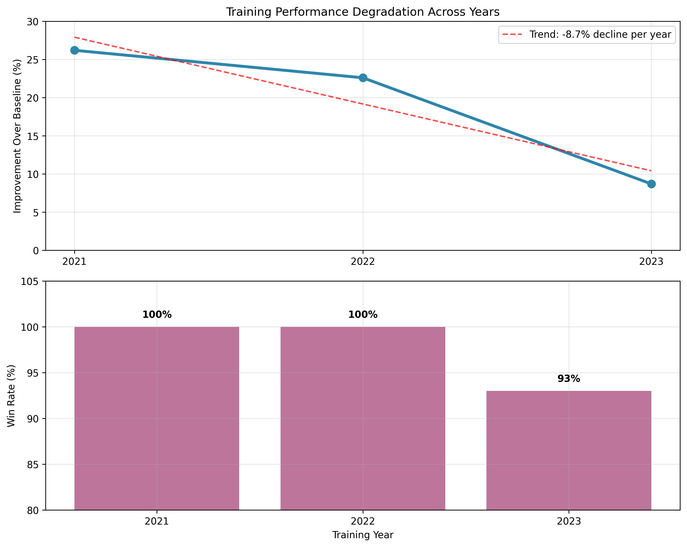

# Fantasy Football Draft Optimization with Deep Reinforcement Learning

**Investigating whether RL agents can learn optimal fantasy football drafting strategies that generalize across seasons**

## Overview

This project explores the application of deep reinforcement learning to fantasy football draft optimization. Using 4 seasons of NFL data (2021-2024), I built custom Gymnasium environments and trained PPO agents to draft superior teams compared to intelligent heuristic baselines.

**Key Finding**: While agents achieved excellent performance on training data (+26% improvement), they failed catastrophically on unseen seasons (-17%), revealing fundamental limitations of RL in rapidly evolving strategic domains.

## Technical Architecture

- **Environment**: Custom Gymnasium environment simulating 12-team snake drafts
- **Action Space**: Discrete choice from 300+ available players with action masking
- **Observation**: Multi-dict featuring roster state, positional needs, and top-5 players per position
- **Algorithm**: Maskable PPO with dense reward shaping and intelligent opponent simulation
- **Scale**: 1M+ training timesteps, 1,200+ evaluation episodes across multiple experiments

## Key Results


### Experiment 1: Single-Year Training (2021)
```
Training/Testing: 2021 data only
Result: Agent 2,387 pts | Baseline 1,680 pts (+42% improvement)
Status: ✅ Perfect overfitting
```

### Experiment 2: Multi-Year Generalization
```
Training: 2021-2023 (weighted sampling)
Testing: Individual years + unseen 2024

2021: +501 pts (+26.2%) ✅
2022: +437 pts (+22.6%) ✅  
2023: +170 pts (+8.7%)  🟡
2024: -331 pts (-16.8%) ❌

Generalization Gap: 700+ points
```



### Experiment 3: Regularization Attempts
```
Training: 2023 only (ADP noise, higher entropy, smaller network)
Testing: 2024
Result: -23% improvement (still failed)
Conclusion: Not an overfitting problem - fundamental domain shift
```

## Key Insights

### Why RL Failed Here
1. **Rapidly Evolving Meta**: Fantasy football strategy changes faster than RL can adapt
2. **Non-Stationary Environment**: Historical patterns became adversarial in new seasons
3. **High Baseline Quality**: Heuristic opponents already encoded most exploitable patterns
4. **Domain Characteristics**: High variance, rule changes, shifting player usage patterns

### When RL Works vs. Struggles
**RL Excels**: Stable environments (chess, Go) with consistent rules and optimal strategies

**RL Struggles**: Dynamic domains where historical data becomes misleading (fantasy sports, financial markets)


Technical Highlights
Advanced Environment Engineering
python# Multi-agent simulation with intelligent opponents
class FantasyDraftEnv(gym.Env):
    def _opponent_pick(self, team_idx):
        # Realistic drafting logic: K/DST timing, positional scarcity, 
        # roster construction rules, late-round strategy shifts
    
    def _build_obs(self):
        # Complex observation space: roster state, positional needs,
        # ADP tier gaps, draft context awareness
        return {"roster": roster_vec, "roster_needs": needs_vec, 
                "QB": top5_qb_features, ...}

# Sophisticated reward engineering
reward = (lineup_improvement / 10.0) + (final_vs_baseline / lineup_scale)
Production-Scale Infrastructure

High-Performance Training: NVIDIA A100 GPU on Google Colab (500+ its/sec)
Optimized Data Pipeline: Pre-processed board templates with 10x faster environment resets
Advanced Observation Processing: Vectorized operations with numpy masking and multi-dict spaces
Multi-Year Training Architecture: Weighted temporal sampling across 3 seasons with dynamic draft position randomization
Robust Evaluation Framework: Statistical validation across 1,200+ episodes with cross-temporal testing

## Repository Structure

```
fantasy-rl-draft/
├── src/                    # Core RL environment and training code
├── notebooks/              # EDA + training colab notebooks
├── data/processed/         # Clean player data 2021-2024
├── data/raw/               # raw data - collected from fantasypros.com & fantasyfootballers.com
├── models/                 # Trained PPO agents
├── tests/                  # Evaluation scripts and analysis
├── results/                # Experimental results and visualizations
├── visualizations/         # Chart generation scripts
└── README.md
```

## Lessons Learned

**Technical**: Environment design and evaluation methodology matter more than model complexity

**Domain**: Some problems require approaches other than RL - knowing when *not* to use a technique is as valuable as knowing when to use it

**Research**: This "failure" provides insights into RL limitations in non-stationary domains, contributing to understanding of when historical data becomes adversarial

---

*The most valuable outcome: Understanding the boundaries of current RL techniques in rapidly evolving strategic domains*